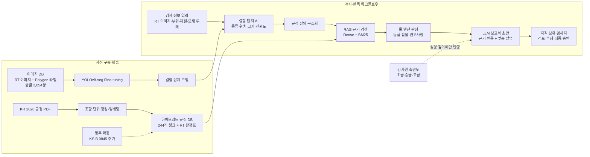

# WeldScan AI 파이프라인 아키텍처 설계 초안

## 1. 장표 핵심 메시지

> AI는 결함을 찾고, RAG는 근거를 찾으며, 룰 엔진은 판정하고, LLM은 검사원 숙련도에 맞게 설명한다. 최종 승인은 자격 보유 검사자가 수행한다.

## 2. 전체 파이프라인



## 3. 단계별 입출력

| 단계 | 핵심 입력 | 처리 | 핵심 출력 |
|---|---|---|---|
| 검사 정보 입력 | RT 이미지, 선박·부위, 재질, 모재 두께 | 요청 데이터 검증 | 표준 검사 요청 |
| 결함 탐지 AI | RT 이미지 | 학습된 YOLOv8-seg 추론 | 결함 종류·위치·영역·크기·신뢰도 |
| 질의 구조화 | 탐지 결과, 검사 조건 | 검색 템플릿 생성 | 규정 검색 질의와 토픽 필터 |
| RAG 근거 검색 | 구조화 질의 | Dense FAISS + BM25 하이브리드 검색 | 관련 조항·페이지·출처·판정표 |
| 룰 엔진 | 결함 정보, 모재 두께, 구조화 판정표 | 결정론적 기준 적용 | 등급·합불·권고사항·판정 근거 |
| LLM 보고서 | 탐지 결과, 판정 결과, 검색 근거, 숙련도 | 근거 제한형 보고서 생성 | 검사원 수준별 판독 보고서 초안 |
| 검사자 승인 | 이미지, 판정 및 보고서 초안 | 검토·수정·승인 | 최종 판독 결과 |

## 4. FastAPI 오케스트레이션

FastAPI가 다음 모듈을 순차 호출하는 단일 워크플로우를 사용한다.

```text
POST /api/v1/inspections
  1. 요청 검증
  2. YOLOv8-seg 추론
  3. 결함 정보 및 규정 질의 구조화
  4. RAG 검색
  5. 룰 엔진 판정
  6. LLM 보고서 생성
  7. 통합 결과 반환

PATCH /api/v1/inspections/{id}/review
  1. 자격 보유 검사자 검토
  2. 수정 의견 및 승인 상태 저장
```

모듈 간에는 자연어가 아니라 구조화된 JSON을 전달한다.

```json
{
  "inspection": {
    "method": "RT",
    "material": "ST",
    "part": "선미 용접부",
    "thickness_mm": 20
  },
  "detection": {
    "type": "crack",
    "size_mm": 12,
    "confidence": 0.94
  },
  "decision": {
    "grade": 4,
    "acceptance": "FAIL",
    "recommendation": "보수용접 후 재검사"
  },
  "evidence": [
    {
      "citation": "KR 2편 지침 부록 2-7 7.",
      "pages": "326-327"
    }
  ],
  "inspector_level": "beginner"
}
```

## 5. 역할 및 책임 분리

- **YOLOv8-seg:** 이미지에서 결함 후보와 형상 정보를 추출한다.
- **RAG:** 판정에 필요한 규정 조항과 출처를 검색한다.
- **룰 엔진:** 구조화된 판정표를 적용해 등급·합불·권고사항을 결정한다.
- **LLM:** 판정값을 변경하지 않고 근거가 포함된 보고서 문장으로 변환한다.
- **검사원 숙련도:** 판정에는 사용하지 않고 설명의 깊이와 용어 수준에만 사용한다.
- **자격 보유 검사자:** AI 결과를 검토하고 최종 판정을 승인한다.

## 6. 숙련도별 설명 정책

| 숙련도 | 보고서 표현 방식 |
|---|---|
| 초급 | 쉬운 용어, 이미지 중심 표시, 판정 이유와 후속 조치를 단계별 안내 |
| 중급 | 결함 수치, 핵심 규정 요약, 등급·합불·재검사 권고 중심 |
| 고급 | 측정 수치와 정확한 조항·페이지 중심의 간결한 보고서 |

등급·합불·권고사항과 적용 규정은 숙련도와 무관하게 동일하게 유지한다.

## 7. 안전장치 및 에스컬레이션

다음 조건에서는 자동 확정 대신 `추가 검토 필요` 상태로 검사자 또는 상급자에게 전달한다.

- 탐지 신뢰도가 기준값 미만인 경우
- 실제 크기 환산에 필요한 스케일 정보가 없는 경우
- 지원하지 않는 결함 유형이 탐지된 경우
- RAG 검색 점수가 낮거나 규정 간 근거가 충돌하는 경우
- 룰 엔진의 필수 입력값이 누락된 경우
- 불합격 또는 중대 결함으로 판정된 경우

## 8. 현재 구축 범위와 향후 구현

| 구성요소 | 상태 |
|---|---|
| 균열 RT 이미지·Polygon 라벨 2,054쌍 | 구축 완료 |
| 이미지·라벨 메타데이터 | 구축 완료 |
| KR 2026 규정 244개 청크 | 구축 완료 |
| Dense FAISS + BM25 검색 인덱스 | 구축 완료 |
| KR RT 판정표 구조화 | 구축 완료 |
| YOLOv8-seg 학습 및 추론 API | 구현 예정 |
| FastAPI 워크플로우 오케스트레이터 | 구현 예정 |
| 규정 기반 룰 엔진 | 구현 예정 |
| 숙련도 맞춤형 LLM 보고서 | 구현 예정 |
| KS B 0845 원문 및 판정표 추가 | 향후 확장 |

## 9. 장표용 축약 문구

각 박스에는 아래 수준까지만 표기한다.

```text
[검사 정보 입력]
RT 이미지 · 부위 · 재질 · 모재 두께

        ↓

[YOLOv8-seg 결함 탐지]
종류 · 위치 · 크기 · 신뢰도

        ↓

[RAG 규정 검색]
KR 2026 · Dense + BM25 · 조항/페이지
KS B 0845 향후 추가

        ↓

[룰 엔진 판정]
등급 · 합불 · 권고사항

        ↓             ← 검사원 숙련도

[LLM 보고서 초안]
근거 인용 · 수준별 맞춤 설명

        ↓

[자격 검사자 최종 승인]
검토 · 수정 · 승인
```

장표 하단에는 다음 문장을 배치한다.

> 검사원 숙련도는 판정 결과에 영향을 주지 않으며, 설명의 깊이와 용어 수준, 에스컬레이션 방식에만 반영한다.
